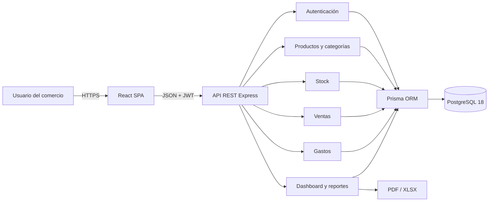
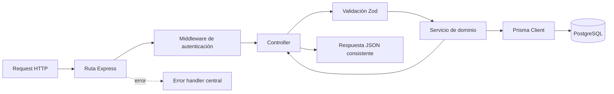

# Arquitectura del sistema

## 1. Propósito

El Sistema de Gestión Comercial Inteligente centraliza operaciones que en un
comercio pequeño o mediano suelen registrarse en planillas, cuadernos o
aplicaciones separadas. El MVP permite administrar productos, existencias,
ventas y gastos, y convertir esos datos operativos en indicadores y reportes.

El problema principal que resuelve es la falta de información integrada. Una
venta no solo genera un comprobante interno: también descuenta stock, conserva
el precio y costo del momento y modifica los resultados del período.

## 2. Estilo arquitectónico

La solución utiliza una arquitectura cliente-servidor formada por:

- una aplicación web de página única (SPA);
- una API REST;
- una base de datos relacional PostgreSQL;
- archivos PDF y Excel generados por el backend.

El backend es un **monolito modular**. Se despliega como una sola aplicación,
pero separa autenticación, catálogo, inventario, ventas, gastos, dashboard y
reportes en módulos. Esta decisión mantiene baja la complejidad operativa del
MVP sin mezclar las responsabilidades del dominio.

## 3. Arquitectura del frontend

El frontend se encuentra en `frontend/` y utiliza React con TypeScript y Vite.
Sus responsabilidades son presentar información, capturar entradas, validar
formularios y consumir la API.

Organización principal:

| Carpeta          | Responsabilidad                                  |
| ---------------- | ------------------------------------------------ |
| `src/app`        | Composición de proveedores globales.             |
| `src/routes`     | Rutas públicas, protegidas y redirecciones.      |
| `src/layouts`    | Estructura visual de autenticación y aplicación. |
| `src/pages`      | Pantallas principales del sistema.               |
| `src/features`   | Acceso a API y estado por funcionalidad.         |
| `src/components` | Componentes visuales reutilizables.              |
| `src/schemas`    | Validaciones de formularios con Zod.             |
| `src/theme`      | Tema global de Material UI.                      |
| `src/types`      | Contratos TypeScript del frontend.               |

### Estado y comunicación

- **TanStack Query** administra datos remotos, caché, cargas y refetch.
- **AuthContext** conserva el usuario autenticado y restaura la sesión.
- **Axios** centraliza la URL base, el timeout y el envío del JWT.
- **React Hook Form + Zod** administran formularios y validaciones.
- **Material UI** aporta componentes, tema, diseño responsive y accesibilidad.
- Un proveedor global presenta notificaciones mediante snackbars.

Las rutas operativas están protegidas. Si la API responde `401`, el cliente
elimina el token local y redirige al login.

## 4. Arquitectura del backend

El backend se encuentra en `backend/` y utiliza Node.js, Express y TypeScript.
Cada petición atraviesa las siguientes capas:

| Capa          | Responsabilidad                            |
| ------------- | ------------------------------------------ |
| Rutas         | Declarar endpoints y middlewares.          |
| Controladores | Traducir HTTP a llamadas de aplicación.    |
| Esquemas Zod  | Validar body, parámetros y filtros.        |
| Servicios     | Aplicar reglas de negocio y transacciones. |
| Prisma        | Consultar y modificar la persistencia.     |
| Middlewares   | Autenticación, roles, 404 y errores.       |

Las respuestas exitosas usan `{ success: true, data, message? }`. Los errores
usan `{ success: false, error: { code, message, details? } }`.

## 5. Persistencia y aislamiento

PostgreSQL 18 almacena la información mediante un modelo relacional gestionado
con Prisma ORM. `Business` es la raíz de pertenencia de los datos comerciales.

El JWT contiene el identificador de usuario, su rol y su comercio. Sin embargo,
el middleware vuelve a consultar el usuario para comprobar que tanto este como
el comercio sigan activos. Los servicios reciben el `businessId` autenticado y
lo agregan a sus consultas. Así se evita que un usuario acceda a recursos de
otro comercio aunque conozca su UUID.

## 6. Integridad transaccional

Las operaciones que modifican varias entidades se ejecutan en transacciones:

- registro: crea el comercio y su usuario;
- venta: crea venta e ítems, descuenta existencias y registra movimientos;
- anulación: cambia el estado, restaura existencias y registra compensaciones;
- movimiento manual: actualiza stock y crea su evidencia histórica.

El stock utiliza control de concurrencia optimista: la actualización exige que
el valor actual coincida con el previamente leído. Si otra operación lo
modificó, la transacción se cancela y solicita reintentar.

## 7. Seguridad aplicada

- contraseñas almacenadas como hash bcrypt, nunca en texto plano;
- JWT firmado y con expiración configurable;
- rate limiting en registro y login;
- rutas comerciales protegidas con `requireAuth`;
- soporte de roles `ADMIN` y `USER`;
- CORS restringido al origen configurado;
- validación Zod en entradas;
- consultas filtradas por comercio;
- secretos fuera del repositorio mediante variables de entorno;
- cabecera `X-Powered-By` deshabilitada;
- errores internos no expuestos al cliente.

## 8. Despliegue previsto

La configuración de producción contempla:

- frontend estático en Vercel;
- API Node.js en Render;
- PostgreSQL 18 administrado en Render;
- migraciones Prisma ejecutadas al desplegar;
- conexión HTTPS entre navegador, frontend y API.

La guía operativa se encuentra en la sección **Despliegue** del README.

## 9. Criterio académico

La arquitectura demuestra separación de responsabilidades, diseño modular,
persistencia relacional, seguridad por capas, consistencia transaccional y
trazabilidad. Para el alcance de un MVP universitario ofrece un equilibrio
razonable entre calidad técnica, tiempo de implementación y facilidad de
operación.
