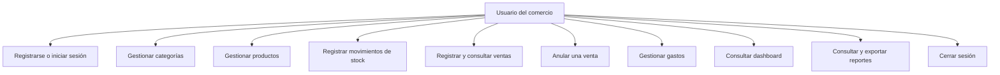

# Casos de uso

## 1. Actores

### Usuario no autenticado

Puede registrar un nuevo comercio, iniciar sesión y consultar únicamente las
rutas públicas de acceso.

### Usuario del comercio

Puede operar productos, categorías, stock, ventas, gastos, dashboard y
reportes del comercio al que pertenece.

### Administrador

Posee el rol `ADMIN`. El backend dispone del middleware `requireRole` para
restricciones por rol, aunque el MVP no incorpora todavía una pantalla de
administración de usuarios.

### Sistema

Ejecuta validaciones, cálculos, actualizaciones transaccionales, generación de
reportes y control de acceso.

## 2. Mapa general

## 3. Casos de uso principales

### CU-01 Registrar comercio y usuario

**Actor:** usuario no autenticado.  
**Precondición:** el correo no está registrado.  
**Flujo principal:**

1. El usuario completa datos personales, comercio, correo y contraseña.
2. El frontend valida el formulario.
3. La API vuelve a validar los datos.
4. El backend genera el hash de contraseña.
5. Una transacción crea `Business` y `User`.
6. Se emite un JWT y el usuario ingresa al sistema.

**Alternativas:** correo duplicado o datos inválidos.  
**Resultado:** comercio y usuario creados sin almacenar la contraseña original.

### CU-02 Iniciar sesión

**Actor:** usuario registrado.  
**Precondición:** usuario y comercio activos.

1. El usuario ingresa correo y contraseña.
2. La API busca el usuario y compara el hash con bcrypt.
3. Se genera un JWT con usuario, comercio y rol.
4. El frontend guarda el token para el MVP y solicita los datos de sesión.

**Alternativas:** credenciales incorrectas, cuenta inactiva o límite de intentos.

### CU-03 Gestionar categorías

El usuario puede listar, crear, editar y desactivar categorías. No puede
desactivar una categoría que tenga productos activos. Todas las operaciones se
limitan al comercio autenticado.

### CU-04 Gestionar productos

El usuario puede listar, consultar, crear, editar y desactivar productos. Al
crear un producto se valida que la categoría pertenezca al comercio y el stock
inicial se fija en cero.

### CU-05 Registrar movimiento de stock

**Precondición:** producto activo del comercio.

1. El usuario selecciona producto, tipo, cantidad y motivo.
2. La API calcula el nuevo stock.
3. Rechaza el movimiento si produciría un valor negativo.
4. Actualiza el producto y crea `StockMovement` en una transacción.

**Resultado:** stock actualizado y movimiento trazable.

### CU-06 Registrar venta

**Precondición:** sesión activa y productos con existencias suficientes.

1. El usuario selecciona productos y cantidades.
2. El frontend muestra el total estimado.
3. La API obtiene precios, costos y stock vigentes.
4. Calcula subtotal, descuento y total.
5. Crea venta e ítems históricos.
6. Descuenta stock y registra movimientos `OUT`.
7. Confirma toda la operación de forma atómica.

**Alternativas:** producto inválido, descuento excesivo, stock insuficiente o
conflicto de concurrencia.

### CU-07 Anular venta

**Precondición:** venta confirmada del comercio.

1. El usuario solicita la anulación y confirma el diálogo.
2. La API cambia el estado a `CANCELLED`.
3. Restaura la cantidad de cada producto.
4. Crea movimientos compensatorios `IN`.
5. Guarda la fecha de anulación.

La venta permanece disponible para consulta, pero deja de participar en los
reportes de ingresos y ganancias.

### CU-08 Gestionar gastos

El usuario puede listar, filtrar por fecha/categoría, crear, editar y dar de
baja gastos. La baja es lógica para preservar la historia.

### CU-09 Consultar dashboard

El sistema presenta ventas del día y mes, gastos y ganancia estimada mensual,
cantidad de ventas, productos con stock bajo y actividad reciente.

### CU-10 Consultar y exportar reportes

El usuario filtra un período y consulta ventas, gastos y rentabilidad. Puede
descargar reportes de ventas o gastos en PDF y Excel.

### CU-11 Cerrar sesión

El frontend informa el logout al backend y elimina el JWT local. Como el MVP no
posee lista de revocación, el cierre es principalmente del lado cliente.

## 4. Reglas comunes

- todas las operaciones comerciales requieren JWT;
- ningún recurso puede consultarse fuera del `businessId` autenticado;
- las entradas se validan con Zod;
- los errores tienen formato JSON uniforme;
- las acciones críticas solicitan confirmación en la interfaz;
- las fechas se presentan en formato argentino;
- las operaciones exitosas o fallidas generan notificaciones visuales.
