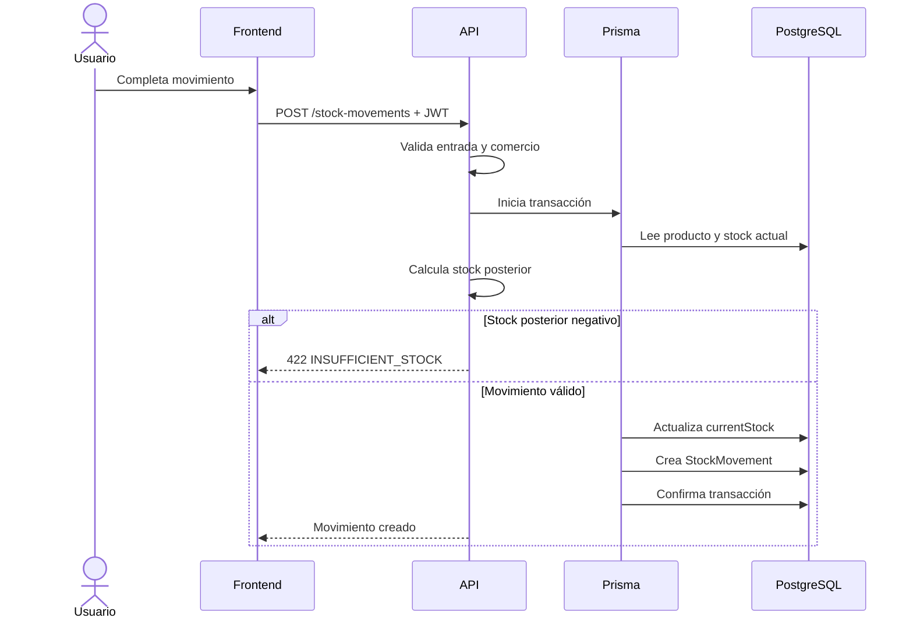
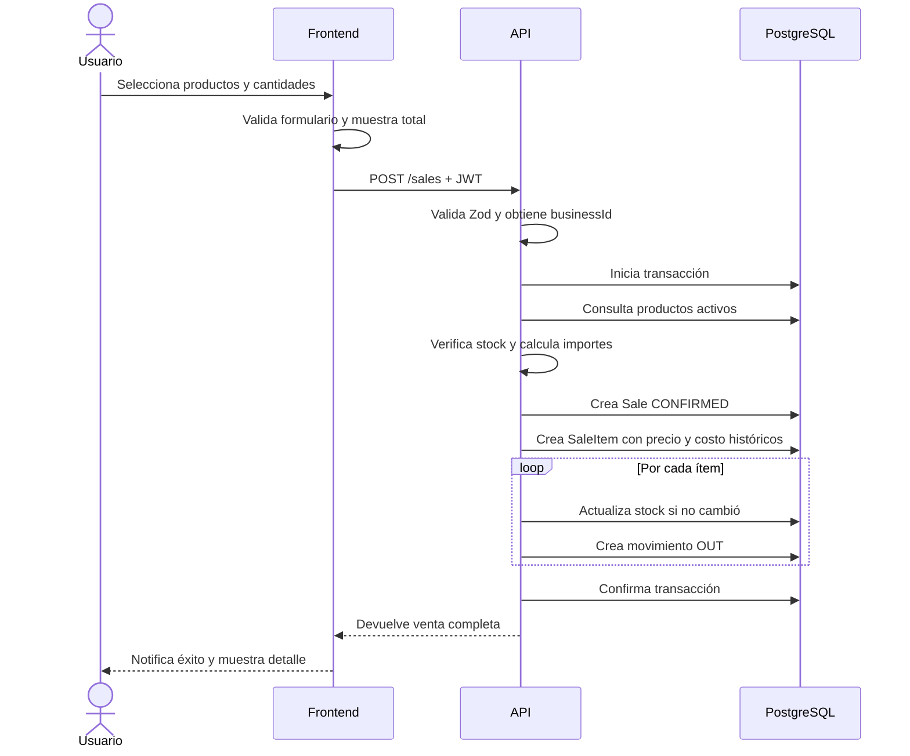
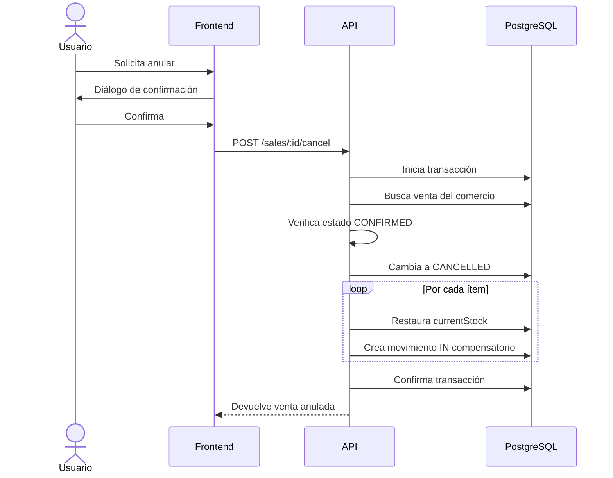

# Flujo de venta y stock

## 1. Objetivo

El flujo integra ventas e inventario para evitar que existan operaciones
confirmadas sin su correspondiente impacto en stock. La venta, sus ítems, los
movimientos y la actualización de productos forman una única unidad lógica.

## 2. Alta manual de stock

### Interpretación de tipos

- `IN`: suma existencias;
- `OUT`: resta existencias;
- `ADJUSTMENT`: aplica la cantidad indicada como variación de ajuste.

El movimiento guarda stock anterior y posterior, producto, usuario, motivo y
fecha.

## 3. Registro de una venta

### Cálculos

Para cada ítem:

`subtotal del ítem = precio de venta vigente × cantidad`

Para la venta:

`subtotal = suma de subtotales de ítems`

`total = subtotal - descuento general`

El backend realiza los cálculos definitivos. La visualización del frontend es
orientativa y no reemplaza la validación del servidor.

### Datos históricos

`SaleItem` copia nombre, SKU, precio y costo del producto. Esto permite:

- consultar una venta aunque el producto cambie;
- calcular la ganancia con el costo existente al vender;
- evitar que una actualización de precios altere reportes pasados.

## 4. Control de stock

Antes de confirmar, el backend compara cada cantidad con `currentStock`. Al
actualizar aplica control de concurrencia optimista:

1. lee el stock;
2. calcula el nuevo valor;
3. actualiza solo si el stock continúa igual al leído;
4. si otra operación lo cambió, cancela toda la transacción.

Este mecanismo evita que dos ventas simultáneas descuenten a partir de la misma
existencia y produzcan stock incorrecto.

## 5. Anulación

La venta no se elimina. Esta decisión preserva trazabilidad y permite explicar
por qué el stock aumentó. Las ventas anuladas se excluyen de ingresos, costos y
ganancias.

## 6. Errores controlados

| Situación                               | Resultado                 |
| --------------------------------------- | ------------------------- |
| Producto inexistente o de otro comercio | Operación rechazada.      |
| Producto inactivo                       | Operación rechazada.      |
| Cantidad mayor al stock                 | `INSUFFICIENT_STOCK`.     |
| Descuento mayor al subtotal             | `INVALID_DISCOUNT`.       |
| Stock modificado simultáneamente        | `STOCK_CONFLICT`.         |
| Venta ya anulada                        | `SALE_ALREADY_CANCELLED`. |
| Venta no confirmada                     | `SALE_STATUS_CONFLICT`.   |

Ante cualquiera de estos errores, la transacción revierte todos sus cambios.

## 7. Resultado académico

El flujo ejemplifica una transacción ACID aplicada a una necesidad real:
mantener consistentes la operación comercial, el inventario actual y el
historial de movimientos.
