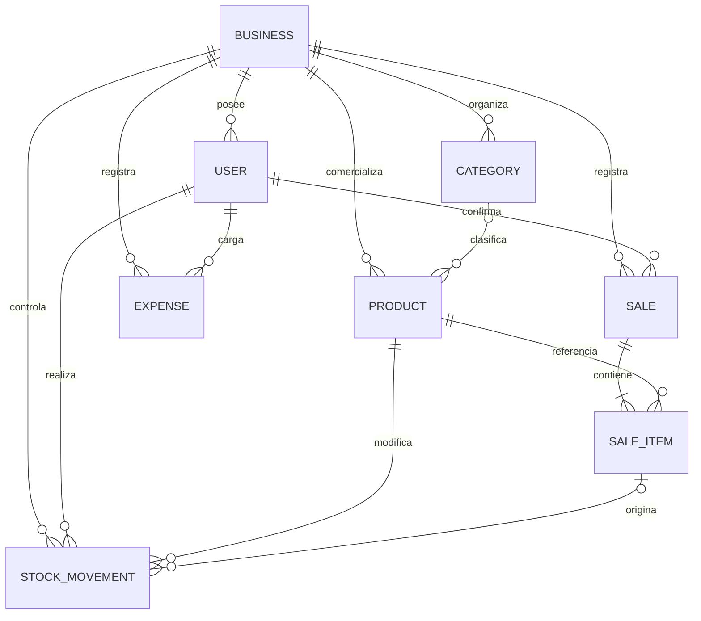

# Modelo de datos

## 1. Criterios de diseño

El modelo representa un comercio, sus usuarios y sus operaciones. Se aplicaron
los siguientes criterios:

- identificadores UUID para evitar dependencias de secuencias públicas;
- claves foráneas con integridad referencial;
- valores monetarios con `Decimal(14,2)`;
- cantidades de stock con `Decimal(14,3)`;
- fechas operativas y marcas de auditoría;
- bajas lógicas donde conservar historia es importante;
- copia de datos históricos en los ítems de venta;
- índices sobre búsquedas frecuentes por comercio y fecha.

## 2. Diagrama entidad-relación

## 3. Entidades principales

### Business

Representa al comercio y funciona como límite de seguridad de los datos.
Contiene nombre, información de contacto, estado y fechas de creación y
modificación.

Relaciones: usuarios, categorías, productos, ventas, gastos y movimientos.

### User

Representa una persona con acceso al sistema.

Campos relevantes:

- `businessId`: comercio al que pertenece;
- `email`: identificador único de acceso;
- `passwordHash`: hash bcrypt;
- `role`: `ADMIN` o `USER`;
- `isActive`: habilitación de la cuenta.

El hash nunca se selecciona en respuestas públicas.

### Category

Clasifica productos dentro de un comercio. El nombre es único por
`businessId`. Su baja es lógica y solo se permite si no tiene productos
activos. Una categoría desactivada puede reactivarse al crear otra con el mismo
nombre.

### Product

Contiene los datos comerciales y de inventario:

- nombre y descripción;
- SKU y código de barras, únicos por comercio;
- precio de venta y costo;
- stock actual y stock mínimo;
- categoría opcional;
- estado activo.

Los productos se crean con stock cero. Las existencias solo cambian mediante
movimientos o ventas. Al desactivar un producto se liberan SKU y código de
barras para evitar bloquear futuros registros.

### Sale

Es la cabecera de una operación de venta. Conserva:

- usuario y comercio;
- estado `DRAFT`, `CONFIRMED` o `CANCELLED`;
- subtotal, descuento y total;
- observaciones;
- fechas de confirmación y anulación.

El flujo actual crea ventas directamente como `CONFIRMED`; `DRAFT` queda
preparado en el modelo para una evolución futura.

### SaleItem

Representa cada producto vendido. Además de la referencia al producto, guarda:

- nombre y SKU históricos;
- cantidad;
- precio unitario histórico;
- costo unitario histórico;
- descuento y subtotal.

Esta duplicación es intencional. Si después cambia el producto, la venta y su
rentabilidad continúan reflejando el momento original.

### Expense

Registra una erogación con categoría textual, descripción, importe, fecha,
usuario y comercio. Usa `isActive` para baja lógica, de modo que eliminar un
gasto no borra físicamente el registro.

### StockMovement

Es la evidencia de cada modificación de inventario:

- tipo `IN`, `OUT` o `ADJUSTMENT`;
- cantidad;
- stock anterior y posterior;
- motivo;
- usuario y producto;
- ítem de venta opcional.

Cuando el movimiento proviene de una venta o anulación, `saleItemId` permite
seguir el vínculo entre la operación comercial y el cambio de existencias.

## 4. Reglas de integridad

| Regla                                         | Implementación                                   |
| --------------------------------------------- | ------------------------------------------------ |
| No vender más que el stock disponible         | Validación dentro de la transacción.             |
| No dejar stock negativo                       | Validación previa a cada movimiento.             |
| Evitar escrituras concurrentes inconsistentes | Actualización condicionada por el stock leído.   |
| Separar datos de comercios                    | Filtro obligatorio por `businessId`.             |
| Conservar ventas anuladas                     | Cambio de estado, sin borrado físico.            |
| Conservar valores históricos                  | Campos copiados en `SaleItem`.                   |
| Conservar gastos dados de baja                | `Expense.isActive = false`.                      |
| Evitar borrar relaciones históricas           | Relaciones principales con `onDelete: Restrict`. |

## 5. Índices y restricciones

Los índices priorizan listados por comercio, fecha, estado y producto. Entre
las restricciones más importantes se encuentran:

- correo único global;
- categoría única por comercio y nombre;
- SKU y código de barras únicos por comercio;
- índices de ventas por comercio/fecha y comercio/estado;
- índices de gastos por comercio/fecha;
- índices de movimientos por comercio/fecha y producto/fecha.

## 6. Limitaciones del modelo actual

- un usuario pertenece a un solo comercio;
- no existen sucursales ni depósitos;
- no se modelan clientes, proveedores o compras;
- la categoría de gasto es texto libre;
- no se registran medios de pago ni impuestos;
- no existe una entidad de auditoría general;
- no hay lotes, vencimientos ni reservas de stock;
- la moneda se interpreta como ARS en la interfaz y exportaciones, pero no se
  almacena como atributo configurable del comercio.
